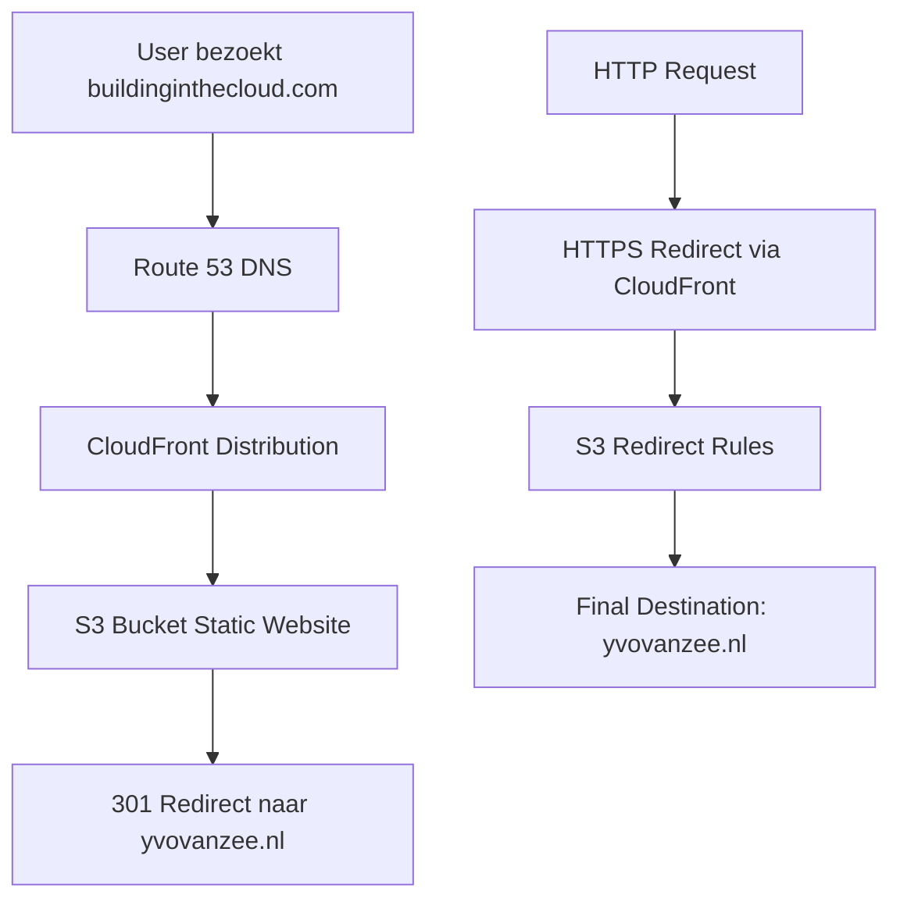

# Design Document - Domain Redirect

## Overview

Dit design implementeert een domain redirect van buildinginthecloud.com naar yvovanzee.nl met behulp van AWS services. De oplossing gebruikt CloudFront distributions voor performante redirects en Route 53 voor DNS management. Het systeem wordt geïmplementeerd met AWS CDK voor Infrastructure as Code.

## Architecture

### High-Level Architecture



### Service Selection Rationale

1. **S3 Static Website Hosting**: Zeer kosteneffectief voor redirects, ondersteunt redirect rules
2. **CloudFront**: Biedt global edge locations, SSL/TLS terminatie en HTTPS redirect
3. **Route 53**: DNS management voor beide domeinen
4. **AWS CDK**: Infrastructure as Code voor reproduceerbare deployments

### Cost Comparison
- **S3 + CloudFront**: ~$0.50-2.00/maand (afhankelijk van traffic)
- **Lambda@Edge**: ~$0.60 per miljoen requests + compute tijd
- **S3 Redirect**: Veel goedkoper voor eenvoudige redirects

## Components and Interfaces

### 1. CDK Stack Structure

```typescript
// Hoofdstack voor domain redirect
class DomainRedirectStack extends Stack {
  // S3 bucket met static website hosting
  // S3 redirect rules configuratie
  // CloudFront distribution voor HTTPS
  // Route 53 hosted zone configuratie
  // SSL certificaten via ACM
}
```

### 2. S3 Static Website Hosting

**Purpose**: Hosts redirect rules voor domain redirect

**Configuration**:
- Static website hosting enabled
- Index document: niet gebruikt (alleen redirects)
- Redirect rules: XML configuratie voor alle requests

**Key Logic**:
- S3 redirect rules sturen alle requests naar yvovanzee.nl
- Behoudt URL path en query parameters
- Retourneert 301 redirect responses

### 3. CloudFront Distribution

**Configuration**:
- Custom domain: buildinginthecloud.com
- SSL Certificate: ACM certificate voor HTTPS
- Origin: S3 bucket static website endpoint
- Behavior: HTTP naar HTTPS redirect
- Cache: Short TTL voor redirect responses (5 minuten)

### 4. Route 53 Configuration

**DNS Records**:
- A record: buildinginthecloud.com → CloudFront distribution
- AAAA record: IPv6 support
- CNAME: www.buildinginthecloud.com → buildinginthecloud.com

## Data Models

### Redirect Configuration

```typescript
interface RedirectConfig {
  sourceDomain: string;        // buildinginthecloud.com
  targetDomain: string;        // yvovanzee.nl
  preservePath: boolean;       // true
  forceHttps: boolean;         // true
  redirectCode: number;        // 301
}
```

### S3 Redirect Rules

```xml
<RoutingRules>
  <RoutingRule>
    <Redirect>
      <Protocol>https</Protocol>
      <HostName>yvovanzee.nl</HostName>
      <HttpRedirectCode>301</HttpRedirectCode>
    </Redirect>
  </RoutingRule>
</RoutingRules>
```

## Error Handling

### 1. DNS Propagation Issues
- **Detection**: Health checks via Route 53
- **Mitigation**: Retry mechanism met exponential backoff
- **Monitoring**: CloudWatch alarms voor DNS resolution failures

### 2. SSL Certificate Issues
- **Detection**: ACM certificate validation status
- **Mitigation**: Automatische certificate renewal
- **Fallback**: Temporary redirect via HTTP indien HTTPS faalt

### 3. S3 Availability Issues
- **Detection**: CloudWatch metrics voor S3 errors
- **Mitigation**: CloudFront caching van redirect responses
- **Monitoring**: S3 bucket availability alarms

### 4. Deployment Failures
- **Detection**: CDK deployment status
- **Mitigation**: Rollback naar vorige stack versie
- **Prevention**: Pre-deployment validation checks

## Testing Strategy

### 1. Unit Tests
- S3 redirect rules configuratie
- CDK stack resource creation
- SSL certificate validation
- DNS record configuration

### 2. Integration Tests
- End-to-end redirect flow
- SSL certificate validation
- DNS resolution testing
- CloudFront distribution behavior

### 3. Manual Testing Scenarios
- Test buildinginthecloud.com → yvovanzee.nl
- Test http://buildinginthecloud.com → https://yvovanzee.nl
- Test path preservation: buildinginthecloud.com/blog → yvovanzee.nl/blog
- Test query parameters: buildinginthecloud.com?param=value
- Test www subdomain redirect

### 4. Performance Testing
- Redirect response time measurement
- Global edge location performance
- DNS resolution speed
- SSL handshake timing

## Security Considerations

### 1. HTTPS Enforcement
- Alle HTTP requests worden geredirect naar HTTPS
- SSL certificates via AWS Certificate Manager
- TLS 1.2+ enforcement op CloudFront

### 2. Access Control
- IAM roles met least privilege principle
- CloudFront access logs voor monitoring
- S3 bucket policy restrictions (alleen CloudFront access)

### 3. DDoS Protection
- CloudFront built-in DDoS protection
- AWS Shield Standard included
- Rate limiting via CloudFront behaviors

## Deployment Strategy

### 1. Infrastructure Deployment
1. Deploy CDK stack met nieuwe resources
2. Validate SSL certificate creation
3. Configure DNS records
4. Test redirect functionality

### 2. DNS Cutover
1. Update Route 53 records voor buildinginthecloud.com
2. Monitor DNS propagation globally
3. Validate redirect behavior
4. Monitor error rates en performance

### 3. Rollback Plan
1. Revert DNS records naar previous configuration
2. Rollback CDK stack indien nodig
3. Monitor voor service restoration
4. Document lessons learned